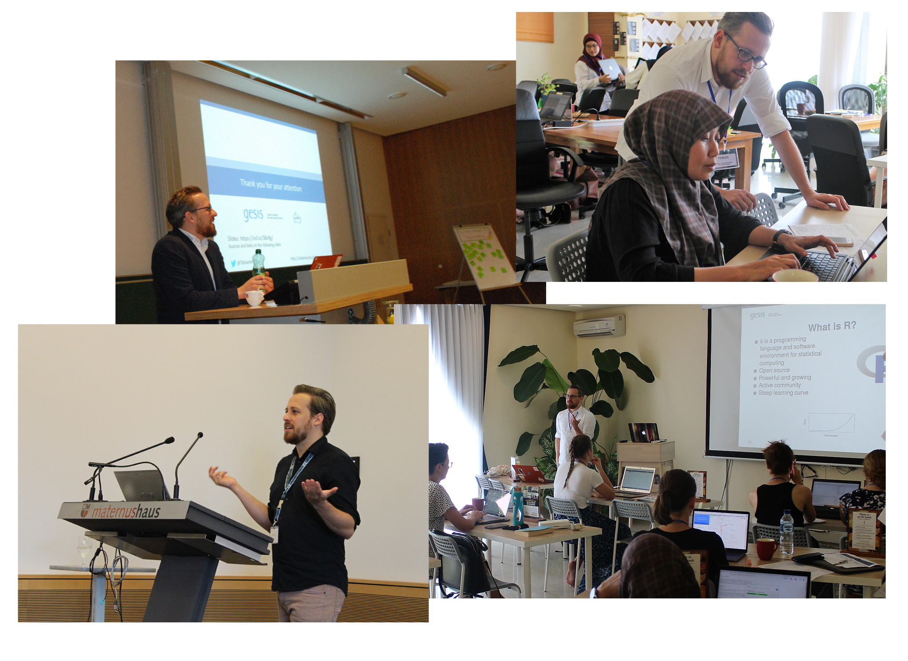

  

[Back to main page](../index.md)

# Talks & Teaching

## Invited talks/ Guest lectures

- Reproducibility and Replicability of Scientific Findings: Challenges and Solutions (May 2019). *Keynote at the workshop: Meanings of Reproducibility*, Graz, [Slides](https://osf.io/38v9g/)
- An Introduction to Open Science (May 2019). *Guest Lecture at the Bachelor Sociology, RWTH Aachen*, Aachen, [Slides](https://osf.io/cmz7t/) 

## University Seminars

- Multivariate Statistics, *University of Cologne, Master Psychology*, 2018
- Theoretical and methodological foundations of Psychology, *University of Cologne, Bachelor Inter-Media*, 2017-2018
- Theoretical and methodological foundations of Psychology, *University of Cologne, Bachelor Inter-Media*, 2016-2017
- Statistics 1, *University of Cologne, Bachelor Psychology*, 2015 - 2016
- Empirical-Experimental Internship, *University of Cologne, Bachelor Psychology*, 2015
- Statistics 1, *University of Cologne, Bachelor Psychology*, 2014 - 2015
- Empirical-Experimental Internship, *University of Cologne, Bachelor Psychology*, 2014
- Statistics 2, *University of Cologne, Bachelor Psychology*, 2014
- Statistics 1, *University of Cologne, Bachelor Psychology*, 2013 - 2014

## Workshops

**2019**

- Open Methodology in Practice: Reproducible Research in R, *GESIS Training*, July 2019 [Slides and Material](https://github.com/TobiasHeycke/reproduzierbare_forschung_pub)
- Introduction to version control using Git, *4th Conference of the Society for Improvement of Psychological Science*, July 2019 [Slides](https://osf.io/h3snq/)
- Introduction to R Markdown, *GESIS – Leibniz Institute for the Social Sciences*, April 2019 [Slides](https://osf.io/ahu8x/)
- A Beginner's Guide to Statistical Computing with R, *Open Science Meeting Bali*, February 2019
- Preregistration of Primary Data Analyses, *Open Science Meeting Bali*, February 2019
- R Markdown With Papaja, *Open Science Meeting Bali*, February 2019 [Led by Sau-Chin Chen]
- Preregistration of Primary Data Analyses, *Open Science Meeting Bali*, February 2019
- Preregistration of Secondary Data Analyses, *Open Science Meeting Bali*, February 2019
- Preregistration in Practice, *Psychology & Law Open Science Conference*, February 2019 [Slides](https://osf.io/n43g8/)

**2018**

- Introduction to git, *GESIS – Leibniz Institute for the Social Sciences*, December 2018
- Introduction to R Markdown, *GESIS – Leibniz Institute for the Social Sciences*, November 2018
- Introduction to SPSS, *Three day workshop for the Regional Computing Centre, University of Cologne*, July 2018
- How to deal with non significant *p* values, *Albertus Magnus Graduate Center, University of Cologne*, January 2018 [Slides](https://osf.io/fvp9q/)

**2017**

- Introduction to SPSS, *Three day workshop for the Regional Computing Centre, University of Cologne*, August 2017
- Introduction to SPSS, *Half day workshop at the German Sport University Cologne*, June 2017
- Inference Statistics in SPSS. *Half day workshop at the German Sport University Cologne*, June 2017
- Introduction to SPSS, *One day workshop for the Graduate School of the Faculty of Law, University of Cologne*, June 2017
- Statistical data analysis in R for HR managers, *Thyssenkrupp AG*, May 2017
- Introduction to SPSS, *Three day workshop for the Regional Computing Centre, University of Cologne*, February 2017

**2016**

- Introduction to SPSS, *Three day workshop for the Regional Computing Centre, University of Cologne*, August 2016
- Introduction to SPSS, *Three day workshop for the Regional Computing Centre, University of Cologne*, February 2016

**2015**

- Introduction to SPSS, *Three day workshop for the Regional Computing Centre, University of Cologne*, August 2015
- Introduction to SPSS, *Three day workshop for the Regional Computing Centre, University of Cologne*, February 2015

## Conference talks

**2019**

- Heycke, T. & Weiß, B. (2019, July). Preregistration of Secondary Data Analysis. Paper presented at the 8th Conference of the European Survey Research Association, Zagreb, Croatia. [Slides](https://osf.io/cqb47/)

- Heycke, T. & Spitzer, L. (2019, March). Screen recordings as a tool to document computer assisted data collection procedures. Paper presented at the ZPID Open Science Conference, Trier, Germany. [Slides](https://osf.io/cbpu9/)

- Heycke, Tobias. (2019, February). Preregistration in Theory, Open Science Meeting, Bali, Indonesia. [Slides](https://osf.io/s8tn7/)

- Heycke, Tobias. (2019, February). Preregistration in Theory, Psychology & Law Open Science Conference, Bali, Indonesia. [Slides](https://osf.io/kcmjq/)

- Heycke, T., Weiß, B., & Kolb, J. P. (2019, January). The GESIS Panel: Heading Towards a FAIR Survey Infrastructure. MZES Open Social Science Conference, Mannheim, Germany. [Slides](https://osf.io/u6am8/)

**2018**

- Aust, F., Heycke, T., & Stahl, C. (2018, September). Does it replicate? Using Bayesian model comparisons to evaluate replication attempts of specific 2×2-interaction patterns. Paper presented at DGPs Congress, Frankfurt, Germany. [Slides](https://crsh.github.io/ml-otm-dgps-slides/)

- Heycke, T., Aust, F., & Stahl, C. (2018, September). Simultaneous stimulus presentation in subliminal evaluative conditioning experiments. Paper presented at ESCON, Cologne, Germany.

- Heycke, T. & Stahl, C. (2018, March). Automatic Preference Acquisition: Subliminal stimulus presentation in Evaluative Conditioning. Paper presented at the Tagung Experimentell Arbeitender Psychologen, Marburg, Germany.

**2017**

- Gawronski, B., & Heycke, T. (2017, October). Associative and propositional processes in evaluative conditioning: A multinomial modeling approach. Talk at the Annual Meeting of the Society of Experimental Social Psychology, Boston, MA, USA.

- Heycke, T., Gehrmann, S., Haaf, J. & Stahl, C. (2017, March). Of two minds or one? A registered replication of Rydell et al. (2006). Talk at the Tagung Experimentell Arbeitender Psychologen, Dresden, Germany.

- Haaf, J., Heycke, T., & Stahl, C. (2017, March). Evaluative conditioning in a dichotic listening paradigm. Talk at the Tagung Experimentell Arbeitender Psychologen, Dresden, Germany.

- Heycke, T., Gehrmann, S., Haaf, J. & Stahl, C. (2017, January). Of two minds or one? A registered replication of Rydell et al. (2006). Paper presented at the SPSP preconference – Attitudes & Social Influence, San Antonio, USA.

**2016 & 2013**

- Heycke, T., Aust, F., & Stahl, C. (2016, July). Subliminal CS Presentation in a Cross-Modal Evaluative Conditioning Paradigm. Paper presented at 5th European Meeting on the Psychology of Attitudes, Cologne, Germany.

- Heycke, T. & Stahl, C. (2016, March). Subliminal CS Presentation in a Cross-Modal Evaluative Conditioning Paradigm. Talk at the Tagung Experimentell Arbeitender Psychologen, Heidelberg, Germany

- Heycke, T., Holland, R., & van Knippenberg, A. (2013, December). Sad Mood Reduces Conscious, but not Unconscious, Stereotypical Associations. (Verdrietige Stemming Vermindert Bewuste, maar niet Onbewuste, Stereotype Associaties). Jaarboek Sociale Psychologie. 

